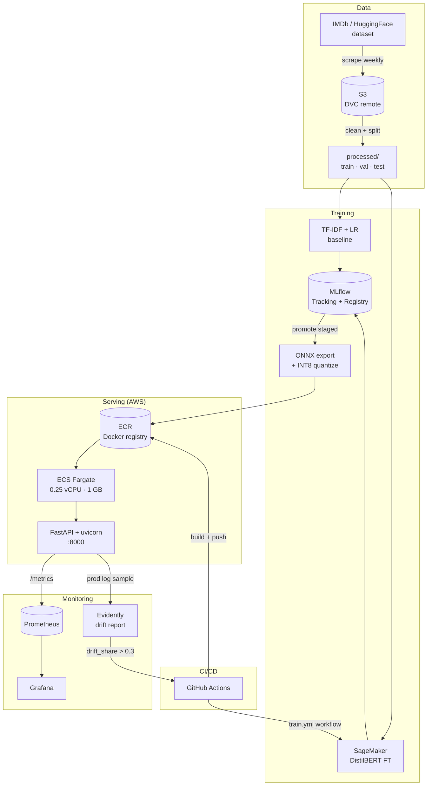

# MovieSentiment

> End-to-end MLOps sentiment analysis for IMDb reviews. Scrape → train → serve → monitor → retrain.

[](https://github.com/Cryptic2-0/Project/actions/workflows/ci.yml)
[](https://securityscorecards.dev/viewer/?uri=github.com/Cryptic2-0/Project)

**Live demo** (deployed on AWS ECS Fargate, `ap-southeast-2`):

```bash
curl -X POST http://54.206.111.36:8000/predict \
     -H "Content-Type: application/json" \
     -d '{"texts":["A masterpiece of modern cinema.","Worst film I have ever seen."]}'
```

> Public IP rotates when the Fargate task restarts. Check `gh issues` or the latest commit for the current URL, or run `make smoke-test` locally.

---

## Architecture



---

## Quickstart

```bash
git clone https://github.com/Cryptic2-0/Project moviesentiment
cd moviesentiment
pip install uv
uv pip install -e ".[dev]"
dvc pull
make export-onnx   # exports base/fine-tuned model → ONNX INT8
make serve         # starts FastAPI on :8000
```

```bash
curl -X POST http://localhost:8000/predict \
     -H "Content-Type: application/json" \
     -d '{"texts": ["A complete masterpiece.", "Worst film I have ever seen."]}'
```

---

## Results

| Model | Accuracy | Macro F1 | ROC-AUC | p50 CPU (ms) | Size |
|-------|----------|----------|---------|--------------|------|
| TF-IDF + LR | 0.904 | 0.904 | 0.967 | <5 ms | 18 MB |
| DistilBERT FP32 ONNX | 0.939 | 0.939 | 0.984 | 14.1 ms | 256 MB |
| DistilBERT INT8 ONNX | 0.939 | 0.939 | 0.984 | 6.8 ms (2.1× speedup) | 64 MB |

See [docs/benchmarks.md](docs/benchmarks.md) for full latency numbers.

---

## Reproduce

```bash
dvc repro                   # scrape → clean → split → train
make export-onnx            # ONNX FP32 + INT8 + benchmark
mlflow ui                   # view experiment runs at localhost:5000
docker compose -f deploy/docker-compose.yml up   # full local stack
```

---

## Monitoring

Local stack (Prometheus + Grafana) via `docker compose`:

- **Grafana**: http://localhost:3000 — dashboard auto-provisioned
- **Prometheus**: http://localhost:9090 — scrapes `/metrics`
- **Custom metrics**: `prediction_confidence`, `prediction_class_total`, `model_version_info`

Drift detection:
```bash
moviesentiment drift   # compares prod logs vs training distribution → HTML report
```

---

## CI/CD

- **`ci.yml`**: lint (ruff + black), type-check (`mypy src tests`), test (pytest + hypothesis, coverage gate **75%**), Docker build (ARM64) → push to **GHCR + AWS ECR** → `aws ecs update-service --force-new-deployment` rolls Fargate to new image.
- **`scorecard.yml`**: OSSF Scorecard supply-chain security scan, weekly.
- **`weekly_bench.yml`**: pulls DVC ONNX artifact, runs latency benchmark + slow ONNX-export e2e test, uploads `bench.txt`.
- **`dependabot.yml`**: weekly pip + GitHub Actions + Docker base image updates, grouped.
- **`train.yml`**: weekly retrain cron + `workflow_dispatch`; promotes model if F1 improves ≥0.5%.
- **`scrape.yml`**: weekly data refresh via HuggingFace dataset.
- **`drift.yml`**: weekly Evidently drift report; triggers `train.yml` if `drift_share > 0.3`.

---

## Features

| Endpoint | What it does |
|---|---|
| `POST /predict` | Sync batch inference (≤32 reviews/req, 60/min rate-limited) |
| `POST /predict/async` | Queues to SQS; Lambda runs inference; result in DynamoDB |
| `GET /predict/result/{job_id}` | Read async job state |
| `POST /explain` | Per-token attribution via occlusion (opt-in, 10/min) |
| `GET /healthz` `/readyz` `/version` | Standard ops endpoints |
| `GET /metrics` | Prometheus scrape target |
| `GET /sample` | Reservoir-sampler debug stats |
| `GET /ui/` | Static frontend (terminal-style demo) |

**Static frontend**: `frontend/index.html` is a self-contained single-page demo with a three-mode toggle (mock keyword classifier · live-auto via public `api.json` · custom IP paste), animated SVG architecture flow, and a live activity strip. Ships via GitHub Pages OR the same Fargate task at `/ui/`. Zero added AWS cost.

**Observability**: structured logs via `structlog` with request-id correlation (`x-request-id` header round-trip), OpenTelemetry traces exported to Grafana Cloud's free tier (see `docs/grafana_cloud_setup.md`), Prometheus metrics for prediction confidence + class distribution, NannyML CBPE for label-free F1 estimation.

**Production sampling**: replaced `random.random() < 0.1` with reservoir sampling (Vitter's Algorithm R, k=1000) for guaranteed uniform coverage at fixed memory.

**Cost**: ARM64 Graviton Fargate, single 0.25 vCPU / 1 GB task. ~$6/mo. SageMaker training uses spot instances (70-90% off) and LoRA adapters (~3 MB vs 250 MB full FT). All monitoring is free tier.

---

## Docs

| File | Purpose |
|---|---|
| `workflow.tex` | End-to-end project workflow, architecture, every component (LaTeX → PDF via `make docs`) |
| `quickstart.tex` | Cold-start guide: clone → install → run → test → deploy (LaTeX → PDF via `make docs`) |
| `docs/model_card.md` | Mitchell et al. template — intended use, per-slice F1, fairness, env impact |
| `docs/datasheet.md` | Gebru et al. template — IMDb 50K provenance, biases, distribution |
| `docs/benchmarks.md` | Raw ONNX latency (single-call timing) |
| `docs/loadtest.md` | End-to-end Locust load test reference numbers + bottleneck breakdown |
| `docs/grafana_cloud_setup.md` | One-time OTLP export setup |
| `docs/future_improvements.md` | Deferred items (LitServe, SageMaker Serverless, multi-language, **v2 Review Intelligence multi-head**) |

Build the PDF docs:

```bash
make docs                       # builds workflow.pdf + quickstart.pdf into docs/build/
# or directly:
bash scripts/build_docs.sh
pwsh scripts/build_docs.ps1
```

---

## What I'd do differently in production

- Replace SQLite MLflow backend with managed Postgres + S3 artifact store.
- Add shadow-deploy: serve new model to 5% traffic for 24h before full promotion.
- Use Airflow/Dagster once >5 pipelines need coordination.
- Add a feature store (Feast) once features are shared across models.
- Promote the data-quality gate from a custom validator to a full Great Expectations suite once schemas multiply.

---

## Roadmap

- [ ] **v2 Review Intelligence** — multi-head DistilBERT: sentiment + aspect-based sentiment (acting / plot / visuals / pacing / sound) + Ekman emotion + spoiler detection + helpfulness regression. One forward pass, same INT8 ONNX session, ~$0.24 one-time training cost. Service combination no free portfolio-tier API offers. See `docs/future_improvements.md`.
- [ ] Multi-language support (es, fr) via XLM-R — deferred
- [ ] LitServe drop-in if load-test shows queueing — deferred
- [ ] SageMaker Serverless comparison (Fargate vs Serverless cost-per-million) — deferred
- [ ] Active learning loop on low-confidence predictions
- [ ] A/B testing harness with gradual rollout

---

## Release-archive hygiene

`.gitattributes` uses `export-ignore` to keep developer-internal files (build guides, notebooks, CI workflows, pre-commit config, this README's grandparent of docs scaffolding) tracked in the repo *but excluded* from the source-code tarball GitHub auto-generates for each Release. Clone the repo to see everything; download the Release tarball for the slim runtime-only set.

---

## License

MIT
