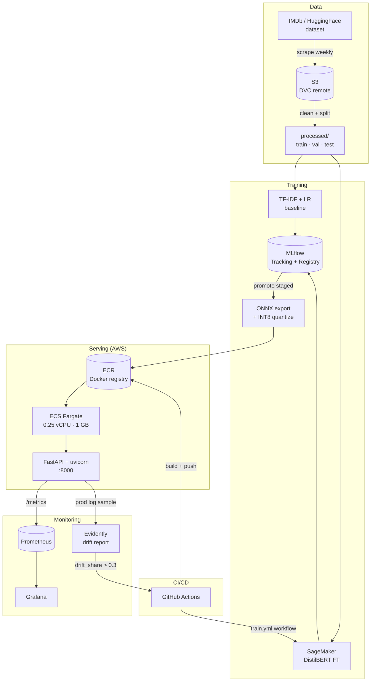

# MovieSentiment

> End-to-end MLOps sentiment analysis for IMDb reviews. Scrape → train → serve → monitor → retrain.

[](https://github.com/Cryptic2-0/Project/actions/workflows/ci.yml)
[](https://securityscorecards.dev/viewer/?uri=github.com/Cryptic2-0/Project)
[](https://huggingface.co/Cryptic2-0/moviesentiment-distilbert-onnx-int8)
[](https://huggingface.co/Cryptic2-0/moviesentiment-multitask-onnx-int8)

**Live demo**:

> **Currently torn down for cost control** (verified 2026-05-29). The ECS Fargate service and Lambdas were scaled-to-zero after the build session. All artefacts remain:
> - ECR image `375259955411.dkr.ecr.ap-southeast-2.amazonaws.com/moviesentiment:latest`
> - S3 `s3://moviesentiment-dvc-soumya/multitask_onnx/` (v2 ONNX, 66 MB)
> - Task definition family `moviesentiment` registered
>
> Redeploy is one command away — see `docs/runbook.md` §3 or run:
> ```bash
> aws ecs create-service --cluster moviesentiment --service-name moviesentiment \
>   --task-definition moviesentiment --desired-count 1 --launch-type FARGATE \
>   --network-configuration "awsvpcConfiguration={subnets=[<subnet>],securityGroups=[<sg>],assignPublicIp=ENABLED}" \
>   --region ap-southeast-2
> ```
>
> Local serving works against the same image via `make serve` or `make docker-up`.

```bash
# Sample request (works against any deployed instance):
curl -X POST http://<host>:8000/predict \
     -H "Content-Type: application/json" \
     -d '{"texts":["A masterpiece of modern cinema.","Worst film I have ever seen."]}'
```

---

## Architecture



---

## Quickstart

```bash
git clone https://github.com/Cryptic2-0/Project moviesentiment
cd moviesentiment
pip install uv
uv pip install -e ".[dev]"

# Option A — pull ONNX models from HuggingFace (public, no auth):
huggingface-cli download Cryptic2-0/moviesentiment-distilbert-onnx-int8 \
  --local-dir models/distilbert_onnx_int8
huggingface-cli download Cryptic2-0/moviesentiment-multitask-onnx-int8 \
  --local-dir models/distilbert_multitask_onnx

# Option B — DVC (S3-backed, requires AWS creds):
dvc pull

make serve         # starts FastAPI on :8000
```

```bash
curl -X POST http://localhost:8000/predict \
     -H "Content-Type: application/json" \
     -d '{"texts": ["A complete masterpiece.", "Worst film I have ever seen."]}'
```

> **Full walkthrough** for running the model + frontend UI + Grafana dashboard locally: [`docs/demo_walkthrough.md`](docs/demo_walkthrough.md).
> **To drive AWS spend to $0**: [`docs/aws_teardown.md`](docs/aws_teardown.md).

---

## Results

| Model | Accuracy | Macro F1 | ROC-AUC | p50 CPU (ms) | Size |
|-------|----------|----------|---------|--------------|------|
| TF-IDF + LR | 0.904 | 0.904 | 0.967 | <5 ms | 18 MB |
| DistilBERT FP32 ONNX | 0.939 | 0.939 | 0.984 | 14.1 ms | 256 MB |
| DistilBERT INT8 ONNX | 0.939 | 0.939 | 0.984 | 6.8 ms (2.1× speedup) | 64 MB |

See [docs/benchmarks.md](docs/benchmarks.md) for full latency numbers.

---

## Reproduce

```bash
dvc repro                   # scrape → clean → split → train
make export-onnx            # ONNX FP32 + INT8 + benchmark
mlflow ui                   # view experiment runs at localhost:5000
docker compose -f deploy/docker-compose.yml up   # full local stack
```

---

## Monitoring

Local stack (Prometheus + Grafana) via `docker compose`:

- **Grafana**: http://localhost:3000 — dashboard auto-provisioned
- **Prometheus**: http://localhost:9090 — scrapes `/metrics`
- **Custom metrics**: `prediction_confidence`, `prediction_class_total`, `model_version_info`

Drift detection:
```bash
moviesentiment drift   # compares prod logs vs training distribution → HTML report
```

---

## CI/CD

- **`ci.yml`**: lint (ruff + black), type-check (`mypy src tests`), test (pytest + hypothesis, coverage gate **85%**), bandit + pip-audit security scans, calibration regression gate, Docker build (ARM64) → push to **GHCR + AWS ECR** → `aws ecs update-service --force-new-deployment` rolls Fargate to new image.
- **`scorecard.yml`**: OSSF Scorecard supply-chain security scan, weekly.
- **`weekly_bench.yml`**: pulls DVC ONNX artifact, runs latency benchmark + slow ONNX-export e2e test, uploads `bench.txt`.
- **`dependabot.yml`**: weekly pip + GitHub Actions + Docker base image updates, grouped.
- **`train.yml`**: weekly retrain cron + `workflow_dispatch`; promotes model if F1 improves ≥0.5%.
- **`scrape.yml`**: weekly data refresh via HuggingFace dataset.
- **`drift.yml`**: weekly Evidently drift report; triggers `train.yml` if `drift_share > 0.3`.

---

## Features

| Endpoint | What it does |
|---|---|
| `POST /predict` | Sync batch inference (≤32 reviews/req, 60/min rate-limited) |
| `POST /analyze` | v2 multi-task: sentiment + ABSA + emotion + spoiler + helpfulness in one pass (30/min) |
| `POST /predict/async` | Queues to SQS; Lambda runs inference; result in DynamoDB |
| `GET /predict/result/{job_id}` | Read async job state |
| `POST /explain` | Per-token attribution via occlusion (opt-in, 10/min) |
| `GET /similar?text=...&k=5` | Nearest reservoir reviews by TF-IDF cosine (30/min) |
| `GET /insights/{movie_id}` | Aggregated per-movie multi-head insights |
| `GET /healthz` `/readyz` `/version` | Standard ops endpoints |
| `GET /metrics` | Prometheus scrape target |
| `GET /sample` | Reservoir-sampler debug stats |
| `GET /ui/` | Static frontend (terminal-style demo) |

**Auth**: `/predict`, `/analyze`, and `/similar` honour `X-API-Key` against `MS_API_KEY`. Empty key (default) = demo mode, no auth.

**Static frontend**: `frontend/index.html` is a self-contained single-page demo with a three-mode toggle (mock keyword classifier · live-auto via public `api.json` · custom IP paste), animated SVG architecture flow, and a live activity strip. Served at `/ui/` by the same FastAPI process locally; bundled into the Fargate image when deployed. Zero added cost.

**Observability**: structured logs via `structlog` with request-id correlation (`x-request-id` header round-trip), OpenTelemetry traces exported to Grafana Cloud's free tier (see `docs/grafana_cloud_setup.md`), Prometheus metrics for prediction confidence + class distribution, NannyML CBPE for label-free F1 estimation.

**Production sampling**: replaced `random.random() < 0.1` with reservoir sampling (Vitter's Algorithm R, k=1000) for guaranteed uniform coverage at fixed memory.

**Cost (today, v3.1)**: **~$0.37/mo** — storage only (ECR + S3 + CloudWatch). ECS service + Lambdas torn down post-build for cost control; redeploy is one `create-service` away (see [`docs/runbook.md`](docs/runbook.md) §3). Live serving target is ARM64 Graviton Fargate, single 0.25 vCPU / 1 GB task, ~$6/mo when running. SageMaker training was on-demand `ml.g4dn.xlarge` (~$0.75 one-time per model, spot quota was unavailable). Full breakdown by tier in [`docs/scaling.md`](docs/scaling.md); zero-cost teardown in [`docs/aws_teardown.md`](docs/aws_teardown.md).

---

## Docs

| File | Purpose |
|---|---|
| `workflow.tex` | End-to-end project workflow, architecture, every component (LaTeX → PDF via `make docs`) |
| `quickstart.tex` | Cold-start guide: clone → install → run → test → deploy (LaTeX → PDF via `make docs`) |
| `docs/model_card.md` | Mitchell et al. template — intended use, per-slice F1, fairness, env impact |
| `docs/datasheet.md` | Gebru et al. template — IMDb 50K provenance, biases, distribution |
| `docs/benchmarks.md` | Raw ONNX latency (single-call timing) |
| `docs/loadtest.md` | End-to-end Locust load test reference numbers + bottleneck breakdown |
| `docs/slos.md` | SLI/SLO/error-budget definitions for the live service |
| `docs/runbook.md` | 9 on-call playbooks |
| `docs/shadow_canary.md` | ECS + ALB shadow/canary deploy plan |
| `docs/demo_walkthrough.md` | **Step-by-step to run model + frontend locally** (start here for demo) |
| `docs/demo_script.md` | 3-minute Loom voiceover script |
| `docs/aws_teardown.md` | Drive AWS spend to $0/mo (delete ECR + S3) |
| `docs/grafana_cloud_setup.md` | One-time OTLP export setup |
| `docs/future_improvements.md` | Remaining deferred items |
| `docs/scaling.md` | 4-tier scaling breakdown — Tier 0 ($0–6/mo) to Tier 4 (enterprise) |
| `docs/interview_prep.md` | Exhaustive Q&A drill book (12 sections, every decision + curveball) |
| `docs/interview_talking_points.md` | 60-second answers per topic |
| `final_report.md` | Full project build report (timeline, decisions, costs, code audit) |
| `CHANGELOG.md` | Per-version delta from v0.0-scaffold through v3.1 |

Build the PDF docs:

```bash
make docs                       # builds workflow.pdf + quickstart.pdf into docs/build/
# or directly:
bash scripts/build_docs.sh
pwsh scripts/build_docs.ps1
```

---

## What I'd do differently in production

- Replace SQLite MLflow backend with managed Postgres + S3 artifact store.
- Add shadow-deploy: serve new model to 5% traffic for 24h before full promotion.
- Use Airflow/Dagster once >5 pipelines need coordination.
- Add a feature store (Feast) once features are shared across models.
- Promote the data-quality gate from a custom validator to a full Great Expectations suite once schemas multiply.

---

## Roadmap

### Shipped

- [x] **v2 Review Intelligence** — multi-head DistilBERT (sentiment + 5-aspect ABSA + Ekman emotion + spoiler + helpfulness) in one ONNX forward pass. Trained on SageMaker (~$0.75 on-demand). Live at [`POST /analyze`](docs/demo_walkthrough.md).
- [x] **API key auth** via `MS_API_KEY` + `X-API-Key` header (v2.1).
- [x] **`/similar` endpoint** — TF-IDF nearest-neighbour over the reservoir (v2.1).
- [x] **Calibration regression gate** in CI (Brier score, v2.1).
- [x] **Label-drift detector** (`monitor/drift.py::label_drift`, v2.1).
- [x] **Adversarial robustness tests** (v2.1).
- [x] **Streamlit active-learning labeller** (`apps/annotate/`, v2.1).
- [x] **AWS Budget setup script** at $13/mo ceiling (v2.1).
- [x] **HuggingFace Hub publish** of v1 + v2 INT8 ONNX (v2.3).
- [x] **Demo + teardown + scaling + interview-prep docs** (v3.0, v3.1).

### Deferred

- [ ] Multi-language support (es, fr) via XLM-R — only worth it for multilingual roles.
- [ ] LitServe drop-in if load-test shows queueing — pending real-traffic signal.
- [ ] SageMaker Serverless comparison (Fargate vs Serverless cost-per-million).
- [ ] A/B testing harness with gradual rollout (plan in [`docs/shadow_canary.md`](docs/shadow_canary.md); blocked by ALB cost ceiling).
- [ ] ABSA teacher distillation from `yangheng/deberta-v3-base-absa-v1.1` — v2 aspect head is random-init until this lands.

---

## Release-archive hygiene

`.gitattributes` uses `export-ignore` to keep developer-internal files (build guides, notebooks, CI workflows, pre-commit config, this README's grandparent of docs scaffolding) tracked in the repo *but excluded* from the source-code tarball GitHub auto-generates for each Release. Clone the repo to see everything; download the Release tarball for the slim runtime-only set.

---

## License

MIT
