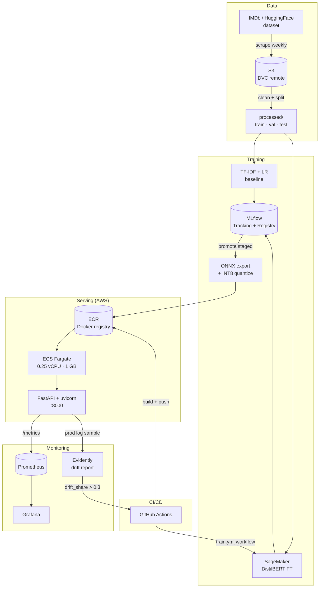

# MovieSentiment

> End-to-end MLOps sentiment analysis for IMDb reviews. Scrape → train → serve → monitor → retrain.

[](https://github.com/Cryptic2-0/Project/actions/workflows/ci.yml)

**Live demo** (deployed on AWS ECS Fargate, `ap-southeast-2`):

```bash
curl -X POST http://54.206.111.36:8000/predict \
     -H "Content-Type: application/json" \
     -d '{"texts":["A masterpiece of modern cinema.","Worst film I have ever seen."]}'
```

> Public IP rotates when the Fargate task restarts. Check `gh issues` or the latest commit for the current URL, or run `make smoke-test` locally.

---

## Architecture



---

## Quickstart

```bash
git clone https://github.com/Cryptic2-0/Project moviesentiment
cd moviesentiment
pip install uv
uv pip install -e ".[dev]"
dvc pull
make export-onnx   # exports base/fine-tuned model → ONNX INT8
make serve         # starts FastAPI on :8000
```

```bash
curl -X POST http://localhost:8000/predict \
     -H "Content-Type: application/json" \
     -d '{"texts": ["A complete masterpiece.", "Worst film I have ever seen."]}'
```

---

## Results

| Model | Accuracy | Macro F1 | ROC-AUC | p50 CPU (ms) | Size |
|-------|----------|----------|---------|--------------|------|
| TF-IDF + LR | 0.904 | 0.904 | 0.967 | <5 ms | 18 MB |
| DistilBERT FP32 ONNX | 0.939 | 0.939 | 0.984 | 14.1 ms | 256 MB |
| DistilBERT INT8 ONNX | 0.939 | 0.939 | 0.984 | 6.8 ms (2.1× speedup) | 64 MB |

See [docs/benchmarks.md](docs/benchmarks.md) for full latency numbers.

---

## Reproduce

```bash
dvc repro                   # scrape → clean → split → train
make export-onnx            # ONNX FP32 + INT8 + benchmark
mlflow ui                   # view experiment runs at localhost:5000
docker compose -f deploy/docker-compose.yml up   # full local stack
```

---

## Monitoring

Local stack (Prometheus + Grafana) via `docker compose`:

- **Grafana**: http://localhost:3000 — dashboard auto-provisioned
- **Prometheus**: http://localhost:9090 — scrapes `/metrics`
- **Custom metrics**: `prediction_confidence`, `prediction_class_total`, `model_version_info`

Drift detection:
```bash
moviesentiment drift   # compares prod logs vs training distribution → HTML report
```

---

## CI/CD

- **`ci.yml`**: lint (ruff + black), type-check (mypy), test (pytest, coverage gate 55%), Docker build → push to **GHCR + AWS ECR** → `aws ecs update-service --force-new-deployment` rolls Fargate to new image.
- **`train.yml`**: weekly retrain cron + `workflow_dispatch`; promotes model if F1 improves ≥0.5%.
- **`scrape.yml`**: weekly data refresh via HuggingFace dataset.
- **`drift.yml`**: weekly Evidently drift report; triggers `train.yml` if `drift_share > 0.3`.

---

## What I'd do differently in production

- Replace SQLite MLflow backend with managed Postgres + S3 artifact store.
- Add shadow-deploy: serve new model to 5% traffic for 24h before full promotion.
- Use Airflow/Dagster once >5 pipelines need coordination.
- Add a feature store (Feast) once features are shared across models.
- Replace `random.random() < 0.1` production sampling with reservoir sampling for guaranteed coverage.

---

## Roadmap

- [ ] Multi-language support (es, fr)
- [ ] Active learning loop on low-confidence predictions
- [ ] A/B testing harness with gradual rollout
- [ ] Online learning for streaming reviews

---

## License

MIT
